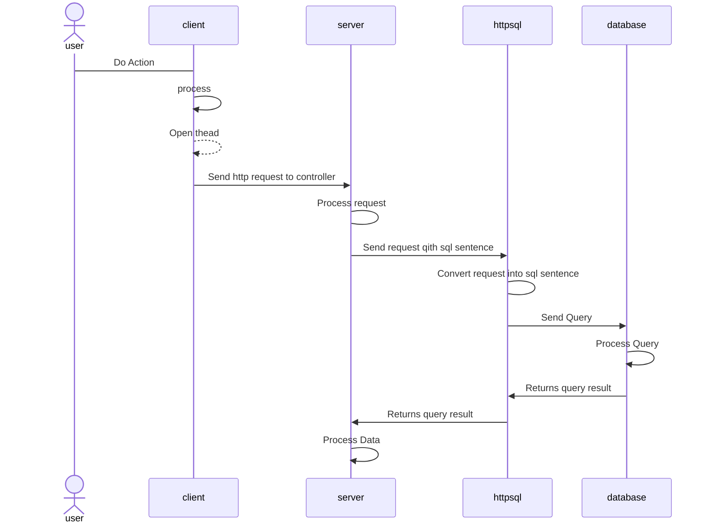

# Automata
### General data flow

```mermaid
sequenceDiagram
  actor user
  participant client
  participant server
  participant httpsql
  participant database
%% 1
  user->client: Do Action
  client->>client: process
%% 1
  client-->>client:Open thead
  client->>server:Send http request to controller
  server->server:Process request
  server->>httpsql:Send request qith sql sentence
  httpsql->httpsql:Convert request into sql sentence
  httpsql->>database:Send Query
  database->>database:Process Query
  database->>httpsql:Returns query result
  httpsql->>server:Returns query result
  server->>server:Process Data


```
